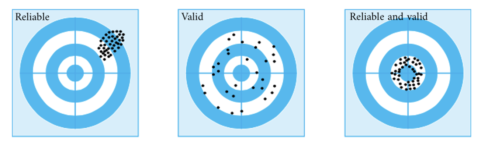

Measurement issues are usually taken for granted.

> We have no trouble talking about the temperature outside, the wight of
> groceries, the speed of a car, etc. We take for granted the
> correspondence between the numbers and the “thing” that we are
> measuring. And we’re usually not worried about the precision—we don’t
> need temperature to the nearest half degree, or our car speed to six
> decimal places.
>
> \[…\]
>
> The property of being precise enough is a combination of the
> properties of the scale and what we are trying to use it for.
>
> Gelman, Hill, and Vehtari (2020, 24)

Measurement in the social sciences is doubly difficult. Sometimes we
want to measure things that are “real” and well defined, but difficult
to count (e.g. number of homeless people). Sometimes we’re trying to
measure something that’s subjective and that doesn’t correspond to a
“thing” we can actually observe.

> Examples include attitudes, beliefs, intentions to vote, and customer
> satisfaction. In all these cases, we share an understanding of what we
> are talking about; it is deeply embedded in our language and
> understanding that people have opinions about things and feelings. But
> attitudes are private, you can’t just weigh them or measure their
> widths. And that also means that to probe them you have to invent some
> kind of measure such as, “Tell us on a scale of 0 to 100 how much you
> enjoyed the service you got today?” The relative answer matters, but
> we could have asked on a scale of 1 to 3, or for that matter 300 to
> 500. We just hope that people can be sincere when they answer and that
> they use the scale the same way. These concerns arise if you are
> designing your own study or when analyzing data collected by others.
>
> Gelman, Hill, and Vehtari (2020, 24)

The following figure is commonly used to introduce the notions of
**validity** and **reliability**:

In short, a measurement is *valid* to the extent that it represents what
you are trying to measure (i.e., hitting the bull’s eye). There’s always
some kind of difference between what we can observe and what we want to
observe.

A measurement is *reliable* If we measure the same thing multiple times,
we would hope that the value doesn’t change (a lot). That is, we want
the variability in our sample too be a consequence of “real” differences
out there, and not a consequence of randomness in the measurement
process.
