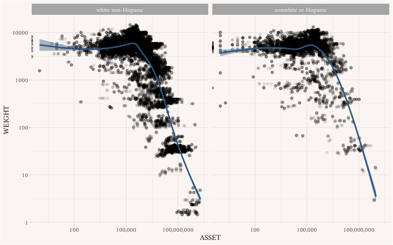

*“Survey weighting is a mess” (Gelman 2007, 153).*

------------------------------------------------------------------------

You will probably not notice much differences in the graphs when
toggling between “Yes” and “No” in the “Use survey weights?” option.
This is not true if you look at the **Survey of Consumer Finances**.
This survey is great to think about this issue because it over-samples
people with high incomes/wealth, so you can expect a lot of differences
between unweighted and weighted summaries.

Take a look at the following graph to get a sense of what this weights
mean.

    ## Warning in self$trans$transform(x): NaNs produced

    ## Warning: Transformation introduced infinite values in continuous x-axis

    ## Warning in self$trans$transform(x): NaNs produced

    ## Warning: Transformation introduced infinite values in continuous x-axis

    ## `geom_smooth()` using method = 'gam' and formula = 'y ~ s(x, bs = "cs")'

    ## Warning: Removed 2645 rows containing non-finite values (`stat_smooth()`).

    ## Warning: Removed 2540 rows containing missing values (`geom_point()`).

*Note. That both* *x* *and* *y* *axes are in a logarithmic scale—i.e.,
they increase by multiples of 10.*

All this means that the averages (and other summary statistics) we
calculate won’t be representative of the whole US population unless we
use the survey weights.
